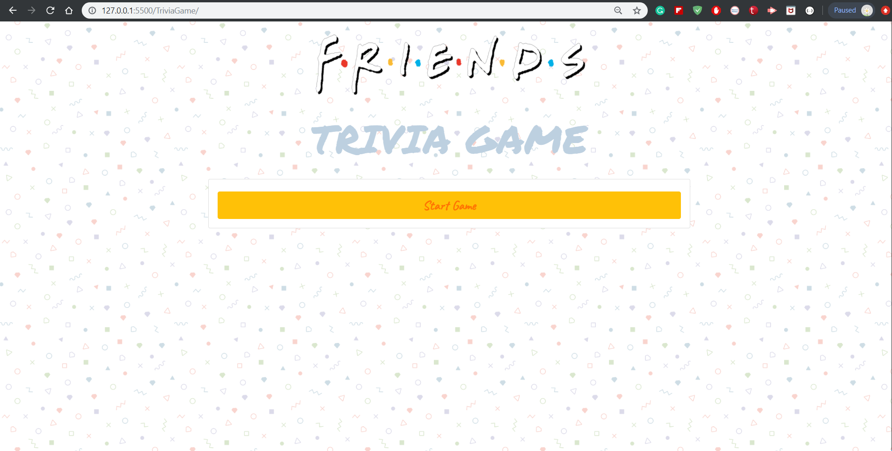
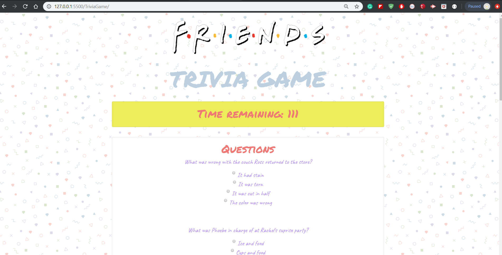
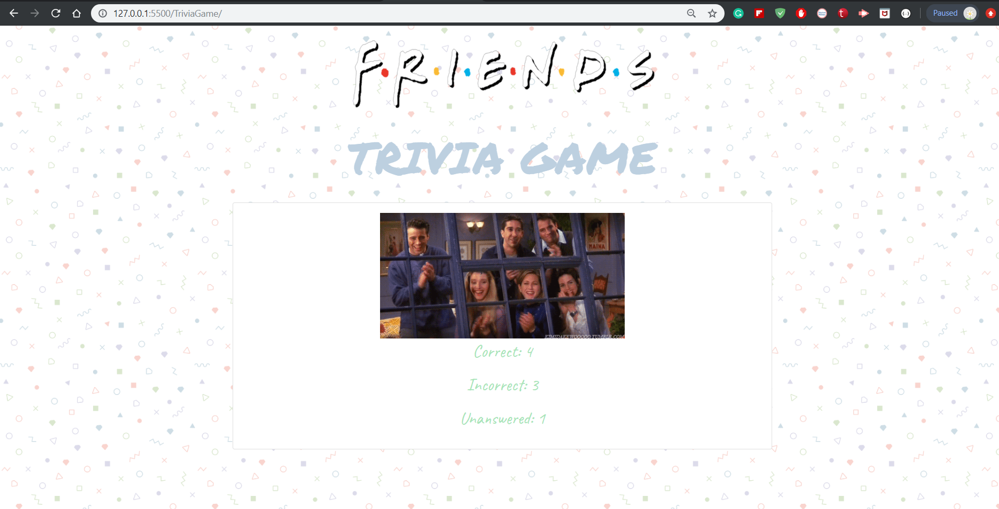

# Trivia Game
---------------
## Table of Contents
1. [Abstract](#abstract)
2. [Coding Overview](#overview)
3. [Game Display](#display)

## Abstract
There are eight questions about Friends tv series. Each question has four options. User should answer the questions within 2 minutes. By clicking the options, the user can mark their choices. After answers are marked, the submit button should be clicked. At the end of the game, the user can see their correct, incorrect, and unanswered questions count.

Game Link : https://pinargultekin.github.io/TriviaGame/

## Coding Overview

The game is built with;
* HTML
* CSS
* Bootstrap
* JavaScript
* jQuery

## Game Display

 

 

### P.S.

<a href="https://giphy.com/gifs/friends-tv-lfmYxOkGpNtEk"> Gifs are created by GIPHY - www.giphy.com</a>
